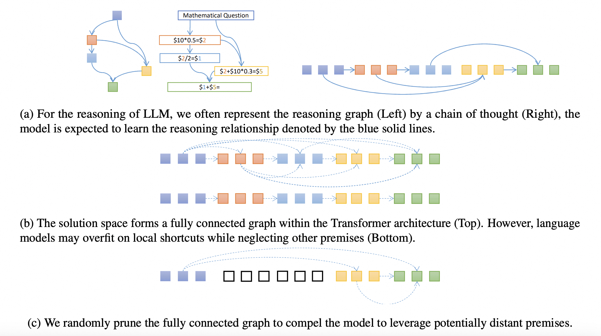

# Masked Thought

This repository contains the code of for our paper:<br>
**Masked Thought: Simply Masking Partial Reasoning Steps Can Improve
Mathematical Reasoning Learning of Language Models**<br>
*Changyu Chen, Xiting Wang, Ting-En Lin, Ang Lv, Yuchuan Wu, Xin Gao, Ji-Rong Wen, Rui Yan, Yongbin Li* <br>
Paper: https://arxiv.org/abs/2403.02178 <br>

### 1. Models and Results
| Model                                                                                                               | GSM8K | MATH  |
|-------------------------------------------------------------------------------------------------|-------|-------|
| [adalaw/MAmmoTH-7B-Mistral-MFT](https://huggingface.co/adalaw/MAmmoTH-7B-Mistral-MFT)        | **77.10** |   **41.2**    |
| [TIGER-Lab/MAmmoTH-7B-Mistral-SFT](https://huggingface.co/TIGER-Lab/MAmmoTH-7B-Mistral)          | 75.00 | 40.0  |
| [adalaw/MetaMath-Mistral-7B-MFT](https://huggingface.co/adalaw/MetaMath-Mistral-7B-MFT)                                                          | **79.90** | **29.0**  |
| [meta-math/MetaMath-Mistral-7B-SFT](https://huggingface.co/meta-math/MetaMath-Mistral-7B)                                                        | 77.70 | 28.2  |
| [adalaw/Llama2-7B-GSM8K-MFT](https://huggingface.co/adalaw/Llama2-7B-GSM8K-MFT) | **47.3**  | - |
| [adalaw/Llama2-7B-GSM8K-SFT](https://huggingface.co/adalaw/Llama2-7B-GSM8K-SFT) | 42.8  | - |
### 2. Overview

We propose to use a simple regularization method **Masked thought Fine-Tuning (MFT)** for the supervised fine-tuning of mathematical reasoning data.
<div  align="center">
 
</div>


### 3. Quick Start
#### 1) Installation
```bash
conda create -n mask python=3.10
conda activate mask
pip install -r requirements.txt
pip install torch==2.1.0 xformers torchvision==0.16.0 torchaudio==2.1.0 --index-url https://download.pytorch.org/whl/cu118
# install vllm
export VLLM_VERSION=0.2.2
export PYTHON_VERSION=310
pip install https://github.com/vllm-project/vllm/releases/download/v${VLLM_VERSION}/vllm-${VLLM_VERSION}+cu118-cp${PYTHON_VERSION}-cp${PYTHON_VERSION}-manylinux1_x86_64.whl torch==2.1.0 transformers==4.36.2
```
#### 2) Train
You can start with training GSM8K on Llama-2-7b with the following command, it will take about one hour with 8 NVIDIA
A100 GPUs.
```bash
bash training_scripts/run_llama2_7b_gsm8k_mft.sh
```
#### 3) Evaluation
The evaluation take 1 minute using vllm and 1 single A100 GPU.
```bash
# exp_name is the save path in your training script.
bash evaluation/run_gen_math_greedy_vllm_1.sh ${model_path}
python evaluation/get_gsm8k_res.py --model ${model_path}
```

For training and evaluation on other datasets and models, you can refer to ```./training_scripts```, ```./MetaMath``` and ```./MAmmoTH```.
You can also refer to the repos of [MetaMath](https://github.com/nlpxucan/WizardLM/tree/main/WizardMath), [MAmmoTH]() and [RFT](https://github.com/OFA-Sys/gsm8k-ScRel/tree/main) for more details about their evaluation and datasets.


### 4. Train with your own code
If you'd like incorporate MFT into your own code, just add the following codes before feeding `input_ids` to the model. `MASK_INDEX` can be the `token_id` of a new added token`[mask]` or the`[pad]` in the original tokenizer, depending on your preference.
```python
def mask_target_tokens(input_ids, sources_tokenized, mask_probability, MASK_INDEX, tokenizer):
    masked_input_ids = copy.deepcopy(input_ids)
    for input_id, source_len in zip(masked_input_ids, sources_tokenized["input_ids_lens"]):
        for i in range(source_len, len(input_id)):
            if random.random() < mask_probability:
                input_id[i] = MASK_INDEX
    return masked_input_ids
input_ids = mask_target_tokens(input_ids, sources_tokenized, _mask_probability, MASK_INDEX)
```

### 5. Citation
```bibtex
@article{chen2024masked,
  title={Masked Thought: Simply Masking Partial Reasoning Steps Can Improve Mathematical Reasoning Learning of Language Models},
  author={Chen, Changyu and Wang, Xiting and Lin, Ting-En and Lv, Ang and Wu, Yuchuan and Gao, Xin and Wen, Ji-Rong and Yan, Rui and Li, Yongbin},
  journal={arXiv preprint arXiv:2403.02178},
  year={2024}
}
```

